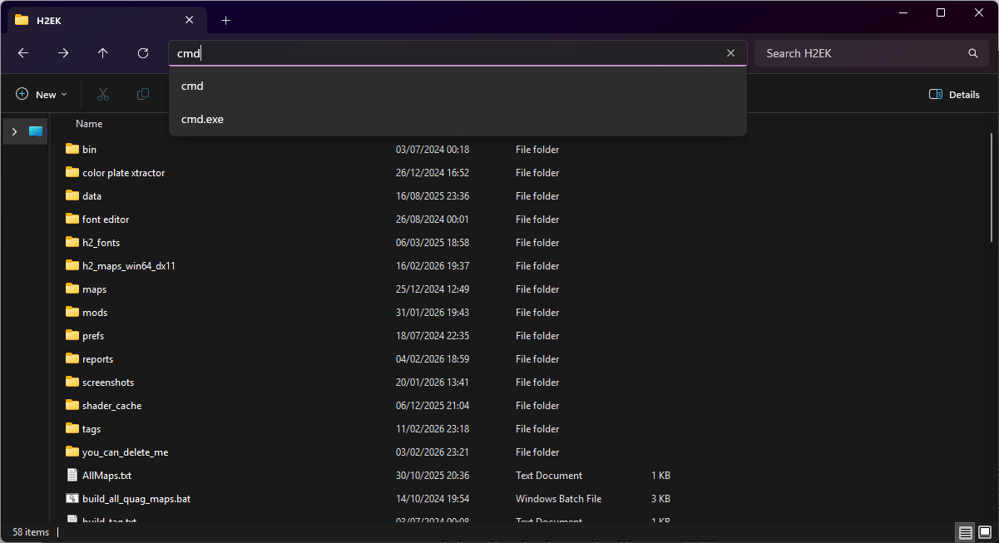
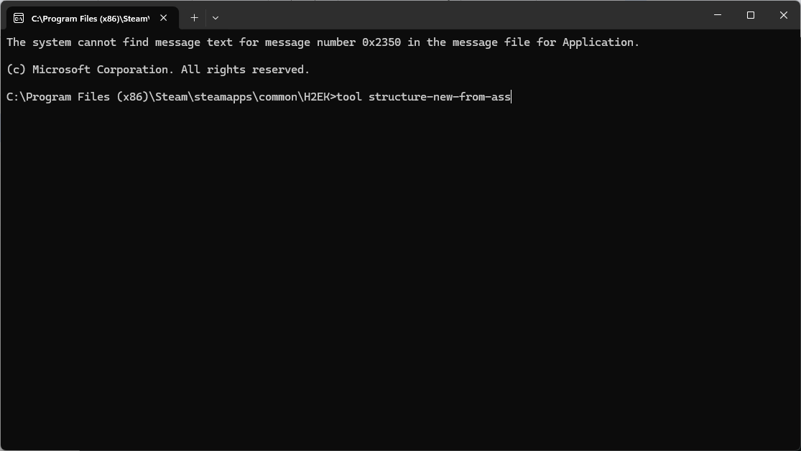
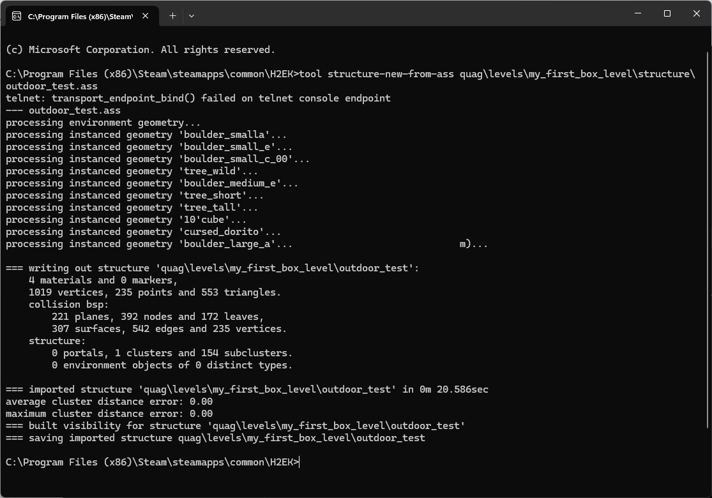
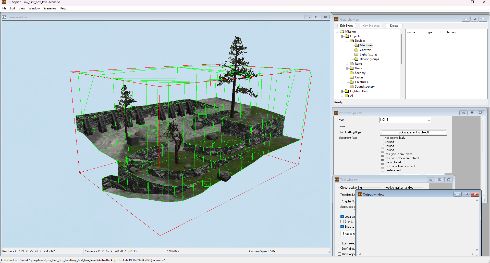
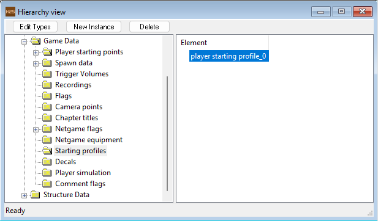
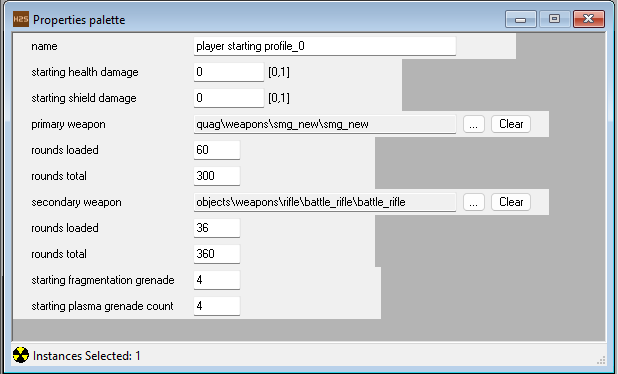
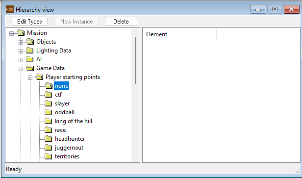
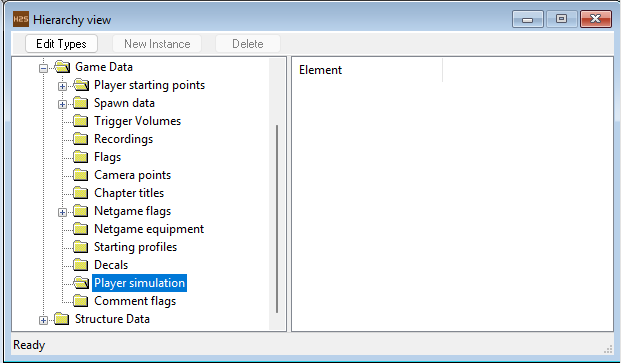


This guide picks up where [level creation - exporting](~exporting) ends and assumes you've exported an [ASS](~ass) file.


# Introduction
This guide will introduce Tool and demonstrate the basics of how to use it to import your level into the game. [Tool](~h2/tools/h2-ek/h2-tool) is a program run through the command prompt, it does not have a GUI (you cannot double click it).

Tool can also be run through [Guerilla](~h2/tools/h2-ek/h2-guerilla) and [Osoyoos](~osoyoos), but it is a foundation skill to know how to run it manually.

# Import
Getting your geometry into the game, your [ASS](~ass) file should be in folder similar to this:

`(H2EK Install Path)\data\scenarios\multi\example\structure\example.ASS`

To start, open your H2EK folder and click on the address bar; type `cmd` and then press enter. 

This will open the command prompt in our H2EK directory, and allows us to run tool.exe simply by typing `tool` and then giving it the instructions we want. For our purposes, the command we will use is `structure-new-from-ass`.

Type the directory and name of your exported [ASS](~ass) file. Tool always looks to the data folder for importing, so you do *not* need to include it in the name. Press enter to run the command, during and after the command runs tool will output various information regarding the process, In this example, no errors were reported.

If nothing happens, check the exact spelling of `tool structure-new-from-ass` and your file path, Tool will do nothing if even *a single letter is wrong*. If successful Tool will process the geometry, report any errors, and create a new [scenario](~) file in the tags folder with a name and folder structure corresponding to the [ASS](~ass) file. If this is the first time importing your level, tool will also assign a default sky and scenario settings, these will *not* be overwritten on subsequent imports of the same level.

If you are still working on the level at this time, you may leave the command prompt window open so that you can quickly re-import your level as you make changes to the geometry. Press up arrow to bring up the last command you entered.

Most import errors in Halo 2 are the same as Halo 1. This [article](~h1/guides/levels/bsp-troubleshooting) explains what they are, and how to fix them.


Tool will always report *telnet: transport_endpoint_bind() failed on telnet console endpoint*, this is leftover code from the xbox era, and you can ignore it



You can view a complete list of commands by typing tool and pressing enter. Not all of these commands are functional, and you can also view the complete list [here](~h2/tools/h2-ek/h2-tool)


# In-game
Opening a level and playing around in it is simple; Open [Sapien](~h2/tools/h2-ek/h2-sapien), a dialog box will prompt you to browse for a [scenario](~), navigate and select your newly created [scenario](~) and open it.

Sapien will begin loading the level, Since it is essentially running the game to do this it may take a while (However you can save time by clicking and dragging around the `loading map` box). When our level has loaded, we will be able to see it in the game window. Arrange the various windows to your liking and press  to save [sapien](~h2/tools/h2-ek/h2-sapien) and the [scenario](~). When you close and reopen [sapien](!h2/tools/h2-ek/h2-sapien) (Close Sapien using  to avoid potential **corruption**), the windows will remain as you left them.

Navigate in the game window by selecting it, then holding the middle mouse button and using the  keys, use  to ascend and  to descend.
Press shift to cycle through camera speeds and hold  for speed boost

# Taking a stroll
Next, we will spawn in and walk around the level as a player, in the `Hierarchy view` window select and expand the `Game Data` folder, select `Starting profiles` and click `New instance`.

In the properties palette, you can customize the starting equipment for Players

In the `Hierarchy view`, select and expand `Player starting points`, Select the `none` folder and *right* click in the game window to place a starting point, when playing this level this is where the first player will spawn, add another for player 2.

Next, select the `Player simulation` folder, then in the game window *right* click to place the player character and then press  to switch to player mode. You can now traverse the level as the player character, Press  again to leave player simulation.

Make sure to save your level every time you make changes you want to keep, using . 

Your next step after you finalize your geometry and have everything imported should be lightmapping.
